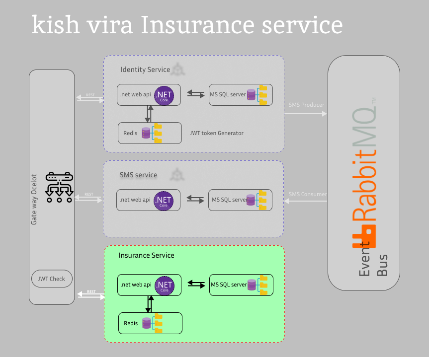

# kish-insurance-service

#### warning:

This is just a sample, so the Authentication and Authorization features have been omitted from the implementation.

## Key features :

### **.NET 8 Web API:**

    The project is built using the latest .NET 8 Web API for improved performance, security, and scalability.

### **Dynamic Coverage Management:**

    Administrators can manage coverage types, including premium rates and capital ranges, dynamically through the database without code changes.

### **Health Insurance Premium Calculation:**

    The system calculates health insurance premiums based on predefined coverage options selected by the insured.

### **API-Driven:**

    Provides RESTful APIs for submitting insurance requests, retrieving requests, and managing coverage types.

### **Query and Pagination Support:**

    Allows users to search insurance requests with query filters and paginated results for better performance and usability.

### **Database and Caching:**

    Utilizes MS SQL Server for the database and Redis for caching data to enhance performance, both running in Docker containers.

### **Validation of Capital Amounts:**

    Ensures that the entered capital for each coverage type falls within the defined minimum and maximum range.

### **Data Persistence:**

    All insurance requests and coverages are stored in the database for future retrieval and auditing.

### **Dockerized Deployment:**

    Easily deploy the service using Docker with`docker-compose`, ensuring a consistent and reproducible environment.

### **SSL Certificate Generation:**

    Provides steps for generating SSL certificates using OpenSSL for secure HTTPS communication.

---

## Service Objective:

The aim of this project is to provide health insurance costs from insurance companies to the insured individuals. In this project, a request containing predefined coverage options is sent to the system for calculating the health insurance premium. Ultimately, the costs are calculated and displayed.

---

## Deployment

### step1:

```
docker compose up -d --build
```

or

```
docker compose up -d
```

### step2:

database migration:

ensure database is up

```
cd ./kish-insurence-services
dotnet ef database update
```

---

## API's:

### Submitting a request:

- [x] POST {{api-endpoint}}/set-order/

Accept:application/json

### Retrieving the list of requests:

- [x] GET {{api-endpoint}}/get-requests/

Accept:application/json
//get order by id

### Retrieving a specific Request by id:

- [x] GET {{api-endpoint}}/get-request/id
      Accept:application/json

### CRUD of CoverageTypes:

- [x] GET/POST/PUT/DELTE {{api-endpoint}}/get-request/{id}
- [x] GET {{api-endpoint}}/all-coverage-types/

Accept:application/json

---

## DB Tables:

#### **Table InsuranceRequests:**

| Name  | Data Type     | Constraints           |
| ----- | ------------- | --------------------- |
| Id    | int           | Primary Key, Identity |
| Title | nvarchar(max) | Not Null              |

#### Table Coverages:

| Name               | Data Type      | Constraints                            |
| ------------------ | -------------- | -------------------------------------- |
| Id                 | int            | Primary Key, Identity                  |
| Type               | int            | Not Null (Foreign Key to CoverageType) |
| Capital            | decimal(18, 2) | Not Null                               |
| InsuranceRequestId | int            | Foreign Key (FK toInsuranceRequests)   |

#### Table CoverageTypes:

| Name        | Data Type      | Constraints           |
| ----------- | -------------- | --------------------- |
| Id          | int            | Primary Key, Identity |
| Name        | nvarchar(100)  | Not Null, Unique      |
| PremiumRate | decimal(5, 4)  | Not Null              |
| MinCapital  | decimal(18, 2) | Not Null              |
| MaxCapital  | decimal(18, 2) | Not Null              |

---

## openssl certificate generate for HTTPS:

#### step1:

openssl req -x509 -newkey rsa:4096 -sha256 -days 3650 -nodes -keyout key.pem -out cert.pem -subj "/C=US/ST=Tehran/L=Tehran /O=ArsacidTechnologies Name/OU=IT Department/CN=localhost" -passout pass:MehranPfx

#### step2:

openssl pkcs12 -export -out certificate.pfx -inkey key.pem -in cert.pem -password pass:MehranPfx

cd Directory: ~:\gh\project-name\certs

dotnet dev-certs https --trust

---

## Architecture:


