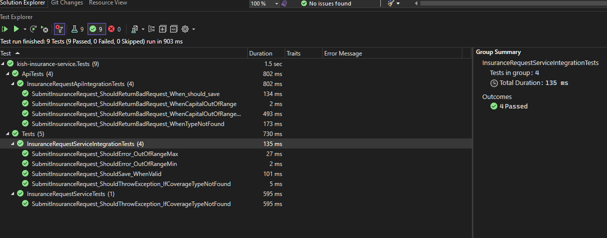
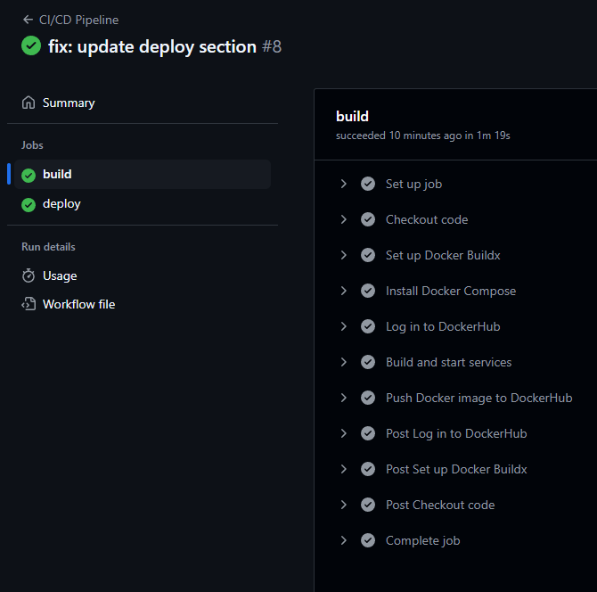

# kish-insurance-service

#### warning:

This is just a sample, so the Authentication and Authorization features have been omitted from the implementation.

---

## **Key Features:**

#### **.NET 8 Web API:**

###### The project is built using the latest .NET 8 Web API for improved performance, security, and scalability.

#### **Dynamic Coverage Management:**

###### Administrators can manage coverage types, including premium rates and capital ranges, dynamically through the database without code changes.

#### **Health Insurance Premium Calculation:**

###### The system calculates health insurance premiums based on predefined coverage options selected by the insured.

#### **Transaction Handling:**

###### Insurance request submissions use database transactions to ensure data consistency and reliability.

#### **API-Driven:**

###### Provides RESTful APIs for submitting insurance requests, retrieving requests, and managing coverage types.

#### **Query and Pagination Support:**

###### Allows users to search insurance requests with query filters and paginated results for better performance and usability.

#### **Database and Caching:**

###### Utilizes MS SQL Server for the database and Redis for caching data to enhance performance, both running in Docker containers.

#### **Validation of Capital Amounts:**

###### Ensures that the entered capital for each coverage type falls within the defined minimum and maximum range.

### **Data Persistence:**

All insurance requests and coverages are stored in the database for future retrieval and auditing.

### **Dockerized Deployment:**

Easily deploy the service using Docker with `docker-compose`, ensuring a consistent and reproducible environment.

### **SSL Certificate Generation:**

Provides steps for generating SSL certificates using OpenSSL for secure HTTPS communication.

4o

## Service Objective:

The aim of this project is to provide health insurance costs from insurance companies to the insured individuals. In this project, a request containing predefined coverage options is sent to the system for calculating the health insurance premium. Ultimately, the costs are calculated and displayed.

---

## Deployment

### step1:

```
docker compose up -d --build
```

or

```
docker compose up -d
```

### step2:

database migration:

ensure database is up

```
cd ./kish-insurence-services
dotnet ef database update
```

---

---

## **API Endpoints:**

---

### **Submitting an Insurance Request:**

- **POST** `{{api-endpoint}}/api/InsuranceRequest/submit-request`
  - **Accept:** application/json
  - **Request Body:**
    - InsuranceRequestDTO (title and coverages)

---

### **Retrieving the List of Insurance Requests:**

- **GET** `{{api-endpoint}}/api/InsuranceRequest/requests`
  - **Query Parameters:**
    - `pageNumber`: integer (default: 1)
    - `pageSize`: integer (default: 10)
    - `title`: string (optional)
    - `coverageTypeId`: integer (optional)
  - **Accept:** application/json

---

### **Retrieving All Insurance Requests:**

- **GET** `{{api-endpoint}}/api/InsuranceRequest/all`
  - **Accept:** application/json

---

### **Retrieving a Specific Insurance Request by ID:**

- **GET** `{{api-endpoint}}/api/InsuranceRequest/{id}`
  - **Path Parameter:**
    - `id`: integer (required)
  - **Accept:** application/json

---

### **Managing Coverage Types (CRUD Operations):**

- **GET** `{{api-endpoint}}/api/CoverageTypes`
  - **Accept:** application/json
  - **Response:** Array of CoverageType
- **POST** `{{api-endpoint}}/api/CoverageTypes`
  - **Request Body:** CoverageType
  - **Accept:** application/json
- **GET** `{{api-endpoint}}/api/CoverageTypes/{id}`
  - **Path Parameter:**
    - `id`: integer (required)
  - **Accept:** application/json
- **PUT** `{{api-endpoint}}/api/CoverageTypes/{id}`
  - **Path Parameter:**
    - `id`: integer (required)
  - **Request Body:** CoverageType
  - **Accept:** application/json
- **DELETE** `{{api-endpoint}}/api/CoverageTypes/{id}`
  - **Path Parameter:**
    - `id`: integer (required)
  - **Accept:** application/json

---

### **Weather Forecast: _just for health check_**

- **GET** `{{api-endpoint}}/WeatherForecast`
  - **Accept:** application/json
  - **Response:** Array of WeatherForecast

## DB Tables:

#### **Table InsuranceRequests:**

| Name  | Data Type     | Constraints           |
| ----- | ------------- | --------------------- |
| Id    | int           | Primary Key, Identity |
| Title | nvarchar(max) | Not Null              |

#### Table Coverages:

| Name               | Data Type      | Constraints                              |
| ------------------ | -------------- | ---------------------------------------- |
| Id                 | int            | Primary Key, Identity                    |
| Type               | int            | Not Null (Foreign Key to CoverageType)   |
| Capital            | decimal(18, 2) | Not Null                                 |
| InsuranceRequestId | int            | Foreign Key (FK toInsuranceRequests)     |
| Premium            | decimal(18, 2) | Not Null (Calculated from `PremiumRate`) |

#### Table CoverageTypes:

| Name        | Data Type      | Constraints           |
| ----------- | -------------- | --------------------- |
| Id          | int            | Primary Key, Identity |
| Name        | nvarchar(100)  | Not Null, Unique      |
| PremiumRate | decimal(5, 4)  | Not Null              |
| MinCapital  | decimal(18, 2) | Not Null              |
| MaxCapital  | decimal(18, 2) | Not Null              |

---

## openssl certificate generate for HTTPS:

#### step1:

openssl req -x509 -newkey rsa:4096 -sha256 -days 3650 -nodes -keyout key.pem -out cert.pem -subj "/C=US/ST=Tehran/L=Tehran /O=ArsacidTechnologies Name/OU=IT Department/CN=localhost" -passout pass:MehranPfx

#### step2:

openssl pkcs12 -export -out certificate.pfx -inkey key.pem -in cert.pem -password pass:MehranPfx

cd Directory: ~:\gh\project-name\certs

dotnet dev-certs https --trust

---

## Architecture:


## Test Results :



## Github workflow CI-CD image:


